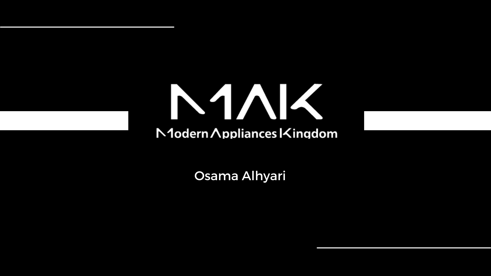
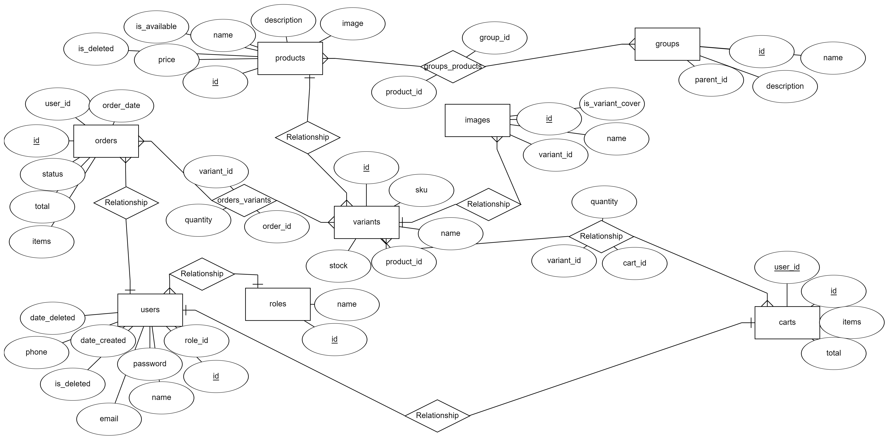

# MasterPiece

## Table of Contents
- [Project Philosophy](#project-philosophy)
- [My Motivation](#my-motivation)
- [Entity Relatshionship Diagram](#entity-relationship-diagram)
- [Run This Project](#run-this-project)

# 🧐 Project Philosophy

> 
> U-Commerce is an e-commerce platform that aims to give control to users over how their online store looks like. 
> 
>Functionality:  
>-Create and add products. 
>-Seperate products into categories (Groups). 
>-Set group images to be showcased on the Landing page. 
>-Create variants of a product and set stock to them. 
>-Set cover images for each variant. 
>-Update and delete products and variants. 
>-Set images in a slider and the pages redirected to from the slider. 
>-View orders made by customers to reject or accept them. 
>  

# 😊 My Motivation

>During my university journey, I worked for the company Modern Appliances Kingdom in multiple different roles: from a security systems technician to being a graphic designer and setting up search ad campaigns. After graduating from university and enrolling in the Orange Coding Academy Bootcamp, I was required to hand in a graduation project "My MasterPiece". After some thought about what project I should build. The right thing to do seemed to be to work for Modern Appliances Kingdom in a new role. A Full-Stack Web developer to build the company website from scratch as the lack of control over how the website looks from the previous e-commerce managment tool was becoming a nuisance.

# 📈 Entity Relatshionship Diagram

# 🏃‍♂️ Run This Project
Prerequisites to running this project : PHP , Composer , Node.js , NPM , A php development enviroment like XAMPP. A MySQL server : MySql Workbench or PhpMyAdmin will work.

1) First you want to clone this project into a directory.

2) Open a terminal, and navigate into the MasterPiece folder in the directory you cloned this repo to. Inside the MasterPiece Folder, navigate to the server folder.

3) You need to run the following commands to install project dependencies:     
   `composer install`    
   `npm install `    
   
4) Run the following command to create your .env file:      
   `copy .env.example .env`
   
5) Go to your new .env file and change the following variables:     
   `DB_CONNECTION=mysql`    
   `DB_HOST= 127.0.0.1` ( Insert The Database Host )     
   `DB_PORT= 3306 ` ( Insert Your Database Port )      
   `DB_DATABASE= ` ( Insert Your Database Name ) You can name this whatever suits you, but you would have to create an empty database with the same name.     
   `DB_USERNAME= root`( Insert Your Database UserName )     
   `DB_PASSWORD= `( Insert Your Database Password )     

7) Generate an app encryption key, run the following command :      
   `php artisan key:generate`

8) Migrate the database using the following command :      
   `php artisan migrate`

9) Seed the database : ( This will provide 2 users and some groups to get you started with the project )       
   `php artisan db:seed`

   The users credentials are : admin@gmail.com & customer@gmail.com       
   The password for both users is 11111qQ!

10) Run the final command to start the server:        
   `php artisan serve`
   
We are now done with setting up the project's server.        
To set up the client side. Using a new terminal, navigate to the client folder inside the MasterPiece folder.

1) Install Client Dependencies using the following command:       
   `npm install`

2) Start the client app:       
    `npm start`
   

